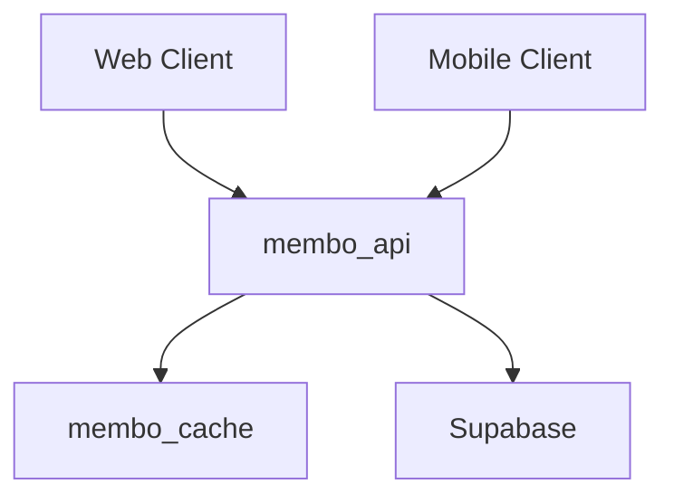
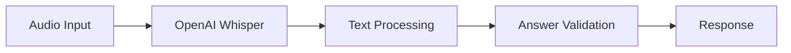
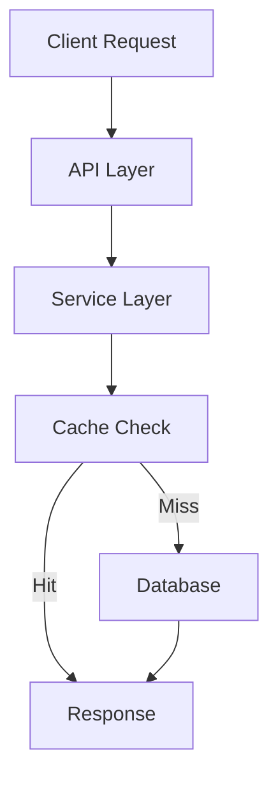

# membo.ai - Enterprise Knowledge Retention System

[](https://github.com/membo-ai/membo/actions)
[](https://github.com/membo-ai/membo/actions)
[](https://github.com/membo-ai/membo/actions)
[](https://github.com/membo-ai/membo/actions)
[](https://github.com/membo-ai/membo/security)
[](https://github.com/membo-ai/membo/security)
[](https://github.com/membo-ai/membo/security)
[](https://opensource.org/licenses/MIT)
[](https://github.com/membo-ai/membo/releases)
[](https://nodejs.org)
[](https://www.postgresql.org)

membo.ai is an enterprise-grade personal knowledge retention system that leverages artificial intelligence and spaced repetition to transform captured content into effective learning materials. Built for scale and security, it serves the needs of both individual learners and enterprise organizations.

## Key Features

- **Enterprise-Ready Capture-First Approach**
  - Seamless content capture across platforms
  - GTD-inspired methodology for knowledge management
  - Automated content processing pipeline

- **AI-Powered Flashcard Generation**
  - Advanced natural language processing
  - Customizable generation rules
  - Quality assurance mechanisms

- **Voice-Enabled Study Mode**
  - Multi-language support
  - Hands-free learning capabilities
  - Real-time pronunciation feedback

- **Advanced Spaced Repetition**
  - FSRS algorithm implementation
  - Personalized learning intervals
  - Performance analytics

- **Enterprise Integration**
  - SSO support (SAML, OAuth)
  - Role-based access control
  - Audit logging

- **Security & Compliance**
  - SOC 2 Type II certified
  - GDPR and CCPA compliant
  - End-to-end encryption

## System Requirements

### Production Environment
- Node.js 20.x LTS
- Docker 24.x
- PostgreSQL 15+
- Redis 7+
- Modern web browser with WebRTC support

### Development Environment
- Git
- Node.js 20.x LTS
- Docker and Docker Compose
- PostgreSQL 15+
- Redis 7+

## Quick Start

```bash
# Clone the repository
git clone https://github.com/membo-ai/membo.git

# Install dependencies
npm install

# Configure environment
cp .env.example .env

# Start development environment
docker-compose up -d

# Run the application
npm run dev
```

## Enterprise Deployment

### Infrastructure Requirements

- Multi-region cloud deployment
- Load balancing configuration
- High availability setup
- Disaster recovery procedures
- Monitoring and alerting system

### Security Configuration

- SSL/TLS configuration
- Network security groups
- WAF rules
- Database encryption
- Audit logging

## Documentation

- [API Documentation](./docs/api)
- [Development Guide](./docs/development)
- [Security Guidelines](./docs/security)
- [Enterprise Setup](./docs/enterprise)
- [Contributing Guidelines](./CONTRIBUTING.md)

## Enterprise Features

### Security & Compliance
- SOC 2 Type II compliance
- GDPR and CCPA compliance
- Enterprise SSO integration
- Data encryption (at rest and in transit)
- Regular security audits
- Vulnerability management

### Scalability
- Horizontal scaling capabilities
- Multi-region deployment support
- Load balancing
- High availability configuration
- Disaster recovery procedures

### Monitoring & Analytics
- Real-time performance monitoring
- Usage analytics
- Learning effectiveness metrics
- Security event tracking
- Custom reporting capabilities

## Support & Maintenance

### Enterprise Support
- 24/7 technical support
- Dedicated account management
- SLA guarantees
- Priority issue resolution
- Regular security updates

### Updates & Maintenance
- Regular feature updates
- Security patches
- Performance improvements
- Backward compatibility
- Migration assistance

## License

This project is licensed under the MIT License - see the [LICENSE](LICENSE) file for details.

## Version History

See [CHANGELOG.md](CHANGELOG.md) for version history and update details.

## Contributing

Please read [CONTRIBUTING.md](CONTRIBUTING.md) for details on our code of conduct and the process for submitting pull requests.

## Security

For security concerns, please refer to our [Security Policy](./SECURITY.md). Enterprise customers should contact their dedicated support representative for immediate assistance.

---

© 2024 membo.ai. All rights reserved.

# membo.ai Development Guide

## Overview
membo.ai is a personal knowledge retention system that uses AI and spaced repetition to transform captured content into smart flashcards. This guide covers local development setup and common workflows.

## Prerequisites

- Docker (24.0.0+)
- Node.js (20.x+)
- Supabase CLI
- OpenAI API key
- pnpm (8.x+)

## Quick Start

1. Clone the repository:
```bash
git clone https://github.com/yourusername/membo.ai.git
cd membo.ai
```

2. Install dependencies:
```bash
pnpm install
```

3. Set up environment variables:
```bash
cp .env.example .env
```

Edit `.env` with your credentials:
```env
OPENAI_API_KEY=your_openai_key
SUPABASE_URL=your_supabase_url
SUPABASE_ANON_KEY=your_anon_key
REDIS_URL=redis://membo_cache:6379
```

4. Start Supabase locally:
```bash
supabase start
```

5. Start the development environment:
```bash
docker compose up
```

## Development Environment

The development stack consists of:

- Backend API (`membo_api`): Node.js/Express
- Cache (`membo_cache`): Redis
- Database: Supabase (PostgreSQL)
- Web Frontend: React
- Mobile: React Native

### Container Structure



### Available Services

| Service | Local URL | Description |
|---------|-----------|-------------|
| API | http://localhost:3000 | Main backend service |
| Web App | http://localhost:5173 | React frontend |
| Redis | localhost:6379 | Cache service |
| Supabase | http://localhost:54323 | Database & Auth |

## Common Development Tasks

### Running Tests
```bash
# Run backend tests
docker compose exec membo_api pnpm test

# Run frontend tests
pnpm test:web
```

### Database Migrations
```bash
# Generate a new migration
supabase db diff -f migration_name

# Apply migrations
supabase db push
```

### Working with Voice Processing

The voice processing feature requires:
1. OpenAI API access for transcription
2. Redis for caching
3. Proper audio file format (WAV)

Test voice processing:
```bash
curl -X POST http://localhost:3000/api/voice/process \
  -H "Content-Type: application/json" \
  -d '{
    "audioData": "base64_encoded_audio",
    "language": "en",
    "expectedAnswer": "test answer"
  }'
```

### Debugging

1. Backend Logs:
```bash
docker compose logs -f membo_api
```

2. Cache Logs:
```bash
docker compose logs -f membo_cache
```

3. Database Logs:
```bash
supabase logs
```

### Hot Reload

- Backend: Automatic with `tsx watch`
- Frontend: Automatic with Vite
- Mobile: Uses React Native development server

## Common Issues & Solutions

1. Redis Connection Issues
```bash
# Check Redis connection
docker compose exec membo_cache redis-cli ping
```

2. Database Connection Issues
```bash
# Check Supabase status
supabase status
```

3. OpenAI API Issues
```bash
# Verify API key
curl https://api.openai.com/v1/models \
  -H "Authorization: Bearer $OPENAI_API_KEY"
```

## Architecture Overview

### Key Components

1. Voice Processing Pipeline:


2. Data Flow:


## Contributing

1. Create a feature branch:
```bash
git checkout -b feature/your-feature-name
```

2. Make your changes and test:
```bash
pnpm test
```

3. Submit a pull request

## Additional Resources

- [OpenAI API Documentation](https://platform.openai.com/docs)
- [Supabase Documentation](https://supabase.com/docs)
- [Redis Documentation](https://redis.io/docs)
- [Project Technical Specifications](./documentation/Technical%20Specifications.md)
- [Product Requirements Document](./documentation/Product%20Requirements%20Document%20(PRD).md)
