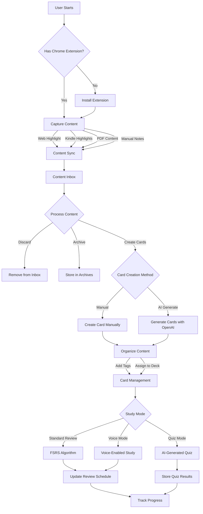
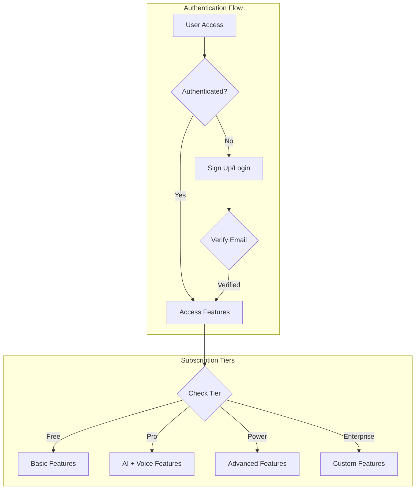
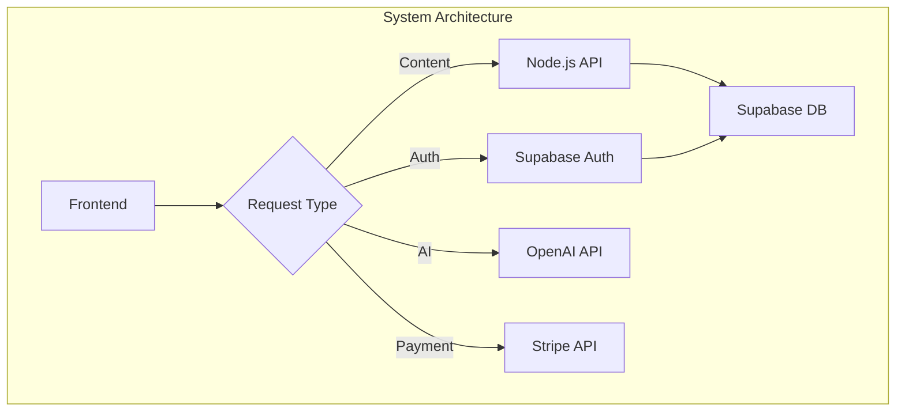
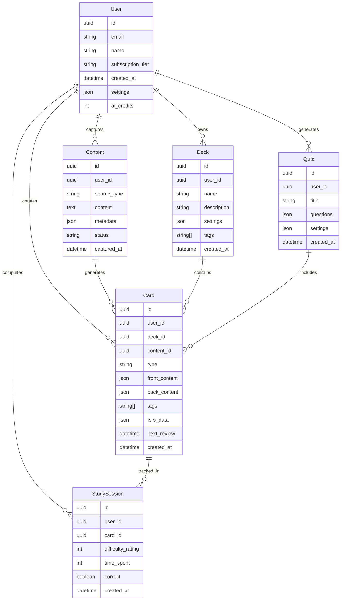
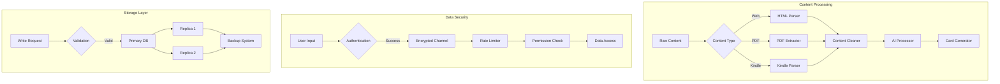

# Product Requirements Document (PRD)

# 1. INTRODUCTION

## 1.1 Purpose

This Product Requirements Document (PRD) outlines the comprehensive specifications for membo.ai, a personal knowledge retention system. The document serves as the primary reference for stakeholders including:

- Development team members
- Project managers
- UX/UI designers
- Quality assurance engineers
- Product owners
- Business stakeholders

## 1.2 Scope

membo.ai is a multi-platform knowledge retention system that transforms captured content into smart flashcards using artificial intelligence and spaced repetition learning techniques.

### Core Functionalities

- Chrome extension for seamless content capture
- AI-powered flashcard generation
- Spaced repetition system (SRS) using the FSRS algorithm
- Voice-enabled study capabilities
- Quiz generation from existing cards and decks
- Content organization through tags and decks
- Cross-platform accessibility (web, mobile, browser extension)

### Key Benefits

- Automated conversion of captured content to effective study materials
- Improved knowledge retention through scientifically-proven spaced repetition
- Hands-free learning capabilities
- Centralized knowledge management
- Time-efficient learning through AI-assisted content processing
- Flexible study options across multiple devices and contexts

### Target Market

- Students seeking efficient study methods
- Language learners requiring consistent practice
- Professionals maintaining industry knowledge
- Interview candidates preparing for assessments
- Knowledge workers managing continuous learning

# 2. PRODUCT DESCRIPTION

## 2.1 Product Perspective

membo.ai operates as a standalone knowledge retention system while integrating with existing platforms and services:

- Browser Integration: Chrome extension for content capture from web pages, PDFs, and Kindle
- Cloud Infrastructure: GCP-hosted backend with Supabase for data management
- AI Services: OpenAI integration for flashcard and quiz generation
- Payment Processing: Stripe integration for subscription management
- Mobile Ecosystem: Cross-platform presence on web and mobile devices

## 2.2 Product Functions

### Content Capture
- Web page text highlighting and saving
- Kindle highlights synchronization
- PDF content extraction
- Note-taking capabilities

### Knowledge Processing
- AI-powered flashcard generation
- Quiz creation from existing cards and decks
- Manual card creation and editing
- Content organization with tags and decks

### Learning System
- FSRS-based spaced repetition scheduling
- Voice-enabled study mode
- Progress tracking and analytics
- Quiz-based assessment

### Content Management
- Inbox processing workflow
- Card and deck organization
- Search and filtering capabilities
- Content archiving

## 2.3 User Characteristics

### Student Persona
- Age: 18-25
- Tech-savvy
- Needs efficient study methods
- Regular, structured learning patterns
- Moderate to high digital literacy

### Professional Persona
- Age: 25-45
- Time-constrained
- Focuses on specific knowledge domains
- Irregular learning patterns
- High digital literacy

### Language Learner Persona
- Age: Various
- Requires consistent practice
- Benefits from voice features
- Mixed digital literacy levels
- Regular, daily engagement

### Interview Candidate Persona
- Age: 22-35
- Time-sensitive learning needs
- Focused on specific topics
- High motivation levels
- Moderate to high digital literacy

## 2.4 Constraints

### Technical Constraints
- Browser extension limited to Chrome initially
- Mobile app development restricted to React Native framework
- AI processing limitations based on OpenAI API quotas
- Voice processing dependent on device capabilities

### Business Constraints
- Tiered pricing structure limiting feature access
- AI usage caps based on subscription level
- Storage limitations for free tier users
- Processing quotas for card generation

### Regulatory Constraints
- GDPR compliance requirements
- Data privacy regulations
- Educational content usage rights
- Voice data handling regulations

## 2.5 Assumptions and Dependencies

### Assumptions
- Users have consistent internet connectivity
- Target audience has basic digital literacy
- Users possess compatible devices
- Chrome remains dominant browser platform
- AI services maintain current pricing models

### Dependencies
- OpenAI API availability and stability
- Supabase service continuity
- Chrome extension policies
- Mobile app store guidelines
- GCP infrastructure reliability
- Stripe payment processing
- Third-party authentication services

# 3. PROCESS FLOWCHART

# 4. FUNCTIONAL REQUIREMENTS

## 4.1 Content Capture Features

### F1: Chrome Extension Capture
**ID**: CAP-001  
**Description**: Browser extension enabling content capture from web pages and PDFs  
**Priority**: High  

| Requirement ID | Requirement Description | Acceptance Criteria |
|---------------|------------------------|-------------------|
| CAP-001.1 | Text highlighting and saving from any webpage | - Highlight persists on page reload - Content syncs to user inbox - Works on all major webpage types |
| CAP-001.2 | Kindle highlights synchronization | - Automatic sync from Kindle notebook - Batch import capability - Proper metadata preservation |
| CAP-001.3 | PDF content extraction | - Highlight and extract text from PDFs - Maintain formatting integrity - Support for searchable PDFs |
| CAP-001.4 | Offline capture functionality | - Queue captures when offline - Auto-sync when connection restored - Local storage management |

### F2: In-App Note Taking
**ID**: CAP-002  
**Description**: Native note-taking capabilities within the application  
**Priority**: Medium  

| Requirement ID | Requirement Description | Acceptance Criteria |
|---------------|------------------------|-------------------|
| CAP-002.1 | Rich text editor | - Basic formatting options - Support for lists and tables - Image insertion capability |
| CAP-002.2 | Real-time saving | - Auto-save functionality - Version history - Conflict resolution |
| CAP-002.3 | Note organization | - Folder structure - Tagging system - Search functionality |

## 4.2 Knowledge Processing Features

### F3: AI Card Generation
**ID**: PROC-001  
**Description**: Automated flashcard creation using OpenAI  
**Priority**: High  

| Requirement ID | Requirement Description | Acceptance Criteria |
|---------------|------------------------|-------------------|
| PROC-001.1 | Content analysis | - Extract key concepts - Identify important relationships - Maintain context |
| PROC-001.2 | Card template selection | - Choose appropriate card type - Apply SRS best practices - Support multiple formats |
| PROC-001.3 | Batch processing | - Handle multiple items - Queue management - Progress tracking |

### F4: Quiz Generation
**ID**: PROC-002  
**Description**: AI-powered quiz creation from existing cards and decks  
**Priority**: Medium  

| Requirement ID | Requirement Description | Acceptance Criteria |
|---------------|------------------------|-------------------|
| PROC-002.1 | Quiz composition | - Multiple question types - Difficulty levels - Time estimates |
| PROC-002.2 | Answer validation | - Correct answer mapping - Alternative answers - Partial credit rules |
| PROC-002.3 | Results tracking | - Score calculation - Progress tracking - Performance analytics |

## 4.3 Learning System Features

### F5: FSRS Implementation
**ID**: LEARN-001  
**Description**: Spaced repetition system using FSRS algorithm  
**Priority**: High  

| Requirement ID | Requirement Description | Acceptance Criteria |
|---------------|------------------------|-------------------|
| LEARN-001.1 | Review scheduling | - Interval calculation - Priority queuing - Schedule adjustments |
| LEARN-001.2 | Performance tracking | - Response time monitoring - Difficulty assessment - Success rate calculation |
| LEARN-001.3 | Algorithm customization | - Parameter adjustment - Custom scheduling rules - Migration capability |

### F6: Voice Study Mode
**ID**: LEARN-002  
**Description**: Voice-enabled study capabilities  
**Priority**: Medium  

| Requirement ID | Requirement Description | Acceptance Criteria |
|---------------|------------------------|-------------------|
| LEARN-002.1 | Speech recognition | - Multiple language support - Accent handling - Noise filtering |
| LEARN-002.2 | Text-to-speech | - Natural voice output - Language switching - Speed control |
| LEARN-002.3 | Hands-free control | - Voice commands - Audio feedback - Session management |

## 4.4 Content Management Features

### F7: Organization System
**ID**: MGT-001  
**Description**: Content organization and management capabilities  
**Priority**: High  

| Requirement ID | Requirement Description | Acceptance Criteria |
|---------------|------------------------|-------------------|
| MGT-001.1 | Tagging system | - Multiple tags per item - Tag hierarchy - Auto-tagging suggestions |
| MGT-001.2 | Deck management | - Nested decks - Sharing capabilities - Import/export |
| MGT-001.3 | Search functionality | - Full-text search - Advanced filters - Sort options |

### F8: Content Processing Workflow
**ID**: MGT-002  
**Description**: Inbox and content processing system  
**Priority**: High  

| Requirement ID | Requirement Description | Acceptance Criteria |
|---------------|------------------------|-------------------|
| MGT-002.1 | Inbox management | - Batch processing - Priority sorting - Status tracking |
| MGT-002.2 | Content triage | - Quick actions - Bulk operations - Processing history |
| MGT-002.3 | Archive system | - Categorization - Retrieval system - Storage optimization |

# 5. NON-FUNCTIONAL REQUIREMENTS

## 5.1 Performance Requirements

### Response Time
- Web application page load: < 2 seconds
- Chrome extension operations: < 1 second
- AI card generation: < 10 seconds for single card
- Voice recognition response: < 500ms
- Database queries: < 100ms
- API endpoints: < 200ms response time
- Mobile app launch time: < 3 seconds

### Throughput
- Support 10,000 concurrent users
- Handle 100,000 daily card reviews
- Process 50,000 daily content captures
- Support 1,000 simultaneous AI operations
- Manage 5,000 concurrent voice sessions

### Resource Usage
- Client-side memory usage: < 100MB for web app
- Chrome extension memory footprint: < 50MB
- Mobile app storage: < 100MB initial install
- Database storage: Auto-scaling with 99.9% availability
- CPU utilization: < 70% under peak load

## 5.2 Safety Requirements

### Data Protection
- Automated hourly backups of user data
- Point-in-time recovery capability up to 30 days
- Redundant storage across multiple GCP regions
- Automatic failover mechanisms
- Daily integrity checks for database consistency

### Failure Recovery
- Maximum data loss window: 5 minutes
- System recovery time: < 4 hours
- Automatic session recovery for interrupted study sessions
- Offline capability for core studying functions
- Local caching of active study materials

## 5.3 Security Requirements

### Authentication
- Multi-factor authentication support
- Session timeout after 30 minutes of inactivity
- Maximum 5 failed login attempts before temporary lockout
- Secure password requirements (minimum 8 characters, mixed case, numbers)
- OAuth 2.0 implementation for Google sign-in

### Authorization
- Role-based access control (RBAC)
- Granular permissions for enterprise accounts
- API access token management
- Resource-level access controls
- Audit logging for all privileged operations

### Data Security
- AES-256 encryption for data at rest
- TLS 1.3 for data in transit
- End-to-end encryption for voice data
- Secure key management through GCP KMS
- Regular security audits and penetration testing

### Privacy
- GDPR-compliant data handling
- Data anonymization for analytics
- User consent management system
- Clear data retention policies
- Privacy-preserving analytics implementation

## 5.4 Quality Requirements

### Availability
- 99.9% uptime for core services
- 99.5% uptime for AI features
- Maximum planned downtime: 4 hours/month
- Automated health checks every minute
- Real-time system status dashboard

### Maintainability
- Comprehensive API documentation
- Modular architecture design
- Automated testing coverage > 80%
- Consistent code style enforcement
- Detailed logging and monitoring

### Usability
- Maximum 3 clicks to reach any feature
- Accessibility compliance with WCAG 2.1 Level AA
- Support for screen readers
- Consistent UI/UX across platforms
- Intuitive error messages and recovery

### Scalability
- Horizontal scaling capability
- Auto-scaling based on load
- Support for 100% annual user growth
- Microservices architecture
- Elastic resource allocation

### Reliability
- Mean Time Between Failures (MTBF): > 720 hours
- Mean Time To Recovery (MTTR): < 30 minutes
- Error rate: < 0.1% for all operations
- Zero data loss guarantee
- Automated system health monitoring

## 5.5 Compliance Requirements

### Legal
- GDPR compliance
- CCPA compliance
- COPPA compliance for users under 13
- Terms of service enforcement
- Privacy policy implementation

### Regulatory
- SOC 2 Type II compliance
- FERPA compliance for educational data
- HIPAA compliance for medical content
- Data residency requirements
- Export control compliance

### Standards
- OpenAPI 3.0 specification
- OAuth 2.0 implementation
- WebRTC standards for voice features
- W3C accessibility standards
- ISO 27001 security standards

# 6. DATA REQUIREMENTS

## 6.1 Data Models

## 6.2 Data Storage

### Primary Storage
- Supabase PostgreSQL for relational data
- Storage requirements:
  - User data: ~1KB per user
  - Content: ~10KB per captured item
  - Cards: ~5KB per card including metadata
  - Study sessions: ~200B per session
  - Estimated growth: 100GB/month at scale

### Retention Policies
- User data: Retained indefinitely while account active
- Content: 
  - Active: Indefinite retention
  - Archived: 2 years
  - Deleted: 30-day soft delete
- Study sessions: 1 year rolling retention
- System logs: 90 days

### Backup Strategy
- Real-time streaming replication across GCP regions
- Hourly incremental backups
- Daily full backups
- Monthly archive backups
- Point-in-time recovery capability for 30 days
- Backup encryption using AES-256

### Data Redundancy
- Multi-region database clusters
- Active-passive configuration
- 99.99% availability target
- Automatic failover with < 30 second RTO
- Cross-region replication lag < 100ms

## 6.3 Data Processing

### Security Measures
- Data encryption at rest using AES-256
- TLS 1.3 for data in transit
- Row-level security in Supabase
- API request signing
- Rate limiting per user/IP
- Input sanitization and validation
- Regular security audits

### Processing Requirements
- Content processing queue with priority levels
- AI processing rate limits per subscription tier
- Batch processing for large imports
- Asynchronous processing for long-running operations
- Error handling and retry mechanisms
- Processing metrics and monitoring

### Data Integrity
- Database constraints and validations
- Referential integrity enforcement
- Transaction management
- Version control for card content
- Audit logging for critical operations
- Data consistency checks

# 7. EXTERNAL INTERFACES

## 7.1 User Interfaces

### Web Application Interface
- Responsive design supporting viewport sizes from 320px to 4K
- Primary navigation:
  - Left sidebar for main menu
  - Top bar for quick actions and notifications
  - Content area with dynamic width
- Key screens:
  - Dashboard
  - Content Inbox
  - Card/Deck Management
  - Study Mode
  - Quiz Interface
  - Settings/Profile

### Mobile Application Interface
- Native iOS and Android implementations using React Native
- Bottom navigation bar with core functions
- Swipe gestures for card review
- Voice control overlay
- Portrait and landscape orientation support
- Adaptive layouts for different screen sizes

### Chrome Extension Interface
- Floating action button for capture mode
- Sidebar overlay (max-width: 380px)
- Highlight controls
- Sync status indicators
- Mini card preview
- Quick capture form

## 7.2 Hardware Interfaces

### Mobile Device Requirements
- Microphone access for voice input
- Speaker access for audio output
- Camera access for image capture
- Minimum RAM: 2GB
- Storage: 100MB free space
- Network: 3G minimum, 4G recommended

### Desktop Requirements
- Microphone access for voice features
- Speaker access for audio feedback
- Minimum display resolution: 1280x720
- Network: Broadband connection (1Mbps minimum)

## 7.3 Software Interfaces

### OpenAI API Integration
- GPT-4 for card generation
- API Version: Latest stable
- Authentication: API key
- Rate limiting: Tier-based
- Error handling protocol
- Fallback mechanisms

### Supabase Integration
- PostgreSQL database access
- Real-time subscriptions
- Authentication services
- Storage interface
- Version: Latest stable
- Connection pooling configuration

### Stripe Payment Integration
- API Version: 2023-10-16
- Payment processing
- Subscription management
- Webhook endpoints
- Test and live environments
- Error handling and logging

### Cloud Storage (GCP)
- Bucket management
- File upload/download
- Access control
- Backup management
- Encryption requirements

## 7.4 Communication Interfaces

### API Protocols
- RESTful API over HTTPS
- WebSocket for real-time updates
- GraphQL for complex queries
- WebRTC for voice features

### Data Formats
- JSON for API responses
- Protocol Buffers for binary data
- Base64 for image encoding
- UTF-8 character encoding
- Markdown for rich text

### Network Requirements
- TLS 1.3 encryption
- HTTP/2 protocol
- WebSocket secure (WSS)
- Maximum payload size: 10MB
- Timeout configurations:
  - API requests: 30s
  - WebSocket: 60s
  - File uploads: 300s

### Authentication Protocols
- JWT tokens
- OAuth 2.0
- API keys
- Session management
- CORS policies

# 8. APPENDICES

## 8.1 GLOSSARY

| Term | Definition |
|------|------------|
| Spaced Repetition System (SRS) | A learning technique that incorporates increasing intervals of time between subsequent review of previously learned material |
| FSRS | Free Spaced Repetition Scheduler - An advanced algorithm for optimizing review intervals in spaced repetition systems |
| Cloze Card | A flashcard format where certain words are removed from a sentence, requiring the learner to fill in the blanks |
| Deck | A collection of related flashcards organized around a specific topic or learning objective |
| Knowledge Retention Management | A systematic approach to capturing, processing, and retaining important information over time |
| GTD (Getting Things Done) | A personal productivity methodology referenced as inspiration for membo's capture-first approach |
| Reverse Trial | A business model where users initially get full feature access for a limited time before being restricted to basic features |

## 8.2 ACRONYMS

| Acronym | Full Form |
|---------|-----------|
| API | Application Programming Interface |
| CCPA | California Consumer Privacy Act |
| COPPA | Children's Online Privacy Protection Act |
| CORS | Cross-Origin Resource Sharing |
| FERPA | Family Educational Rights and Privacy Act |
| GDPR | General Data Protection Regulation |
| GCP | Google Cloud Platform |
| HIPAA | Health Insurance Portability and Accountability Act |
| JWT | JSON Web Token |
| KMS | Key Management Service |
| MTBF | Mean Time Between Failures |
| MTTR | Mean Time To Recovery |
| RBAC | Role-Based Access Control |
| REST | Representational State Transfer |
| RTO | Recovery Time Objective |
| SOC | Service Organization Control |
| SRS | Spaced Repetition System |
| TLS | Transport Layer Security |
| UI/UX | User Interface/User Experience |
| WCAG | Web Content Accessibility Guidelines |
| WSS | WebSocket Secure |

## 8.3 ADDITIONAL REFERENCES

| Resource | Description | URL |
|----------|-------------|-----|
| FSRS Algorithm Documentation | Technical specification of the FSRS algorithm | https://github.com/open-spaced-repetition/free-spaced-repetition-scheduler |
| OpenAI API Documentation | Reference for AI integration | https://platform.openai.com/docs |
| Supabase Documentation | Database and authentication implementation | https://supabase.com/docs |
| React Native Documentation | Mobile development framework | https://reactnative.dev/docs |
| Chrome Extension API | Browser extension development | https://developer.chrome.com/docs/extensions |
| Stripe API Reference | Payment integration | https://stripe.com/docs/api |
| WCAG 2.1 Guidelines | Accessibility standards | https://www.w3.org/WAI/WCAG21/quickref/ |