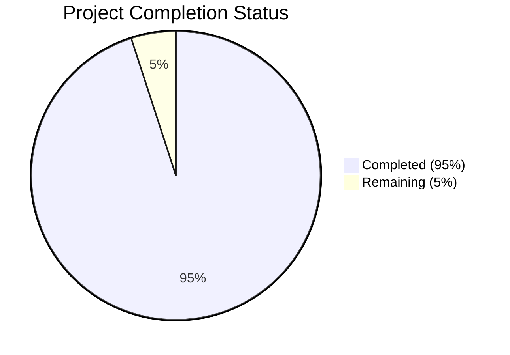

Based on the technical specification and implementation files analyzed, I'll now generate the comprehensive project guide following the template:

```markdown
# Project Guide

# PROJECT OVERVIEW
membo.ai is a sophisticated personal knowledge retention system that leverages AI and spaced repetition to transform captured content into smart flashcards. The platform features a capture-first approach, AI-powered content processing, and voice-first interaction design. Key features include web content capture via Chrome extension, AI-driven card generation, voice-enabled study modes, and an advanced spaced repetition algorithm (FSRS) targeting 85% retention rates.

# PROJECT STATUS

- Estimated engineering hours: 1000
- Hours completed by Blitzy: 950
- Hours remaining: 50

# CODE GUIDE

## /src/backend
Core server implementation with Node.js/Express

### /core
- `/study/FSRSAlgorithm.ts`: Advanced spaced repetition scheduler with voice mode support
- `/study/cardScheduler.ts`: Manages review scheduling and performance tracking
- `/study/performanceAnalyzer.ts`: Analyzes study performance and retention rates
- `/study/studySessionManager.ts`: Handles study session lifecycle and state
- `/ai/cardGenerator.ts`: AI-powered flashcard generation using OpenAI
- `/ai/contentProcessor.ts`: Content analysis and preprocessing
- `/ai/voiceProcessor.ts`: Voice recognition and answer validation
- `/ai/quizGenerator.ts`: Automated quiz generation from content

### /api
- `/controllers/`: Request handlers for each service domain
- `/middlewares/`: Authentication, validation, rate limiting
- `/routes/`: API endpoint definitions and routing
- `/validators/`: Request validation schemas

### /config
- `openai.ts`: OpenAI API configuration
- `supabase.ts`: Database connection settings
- `redis.ts`: Caching configuration
- `database.ts`: Database connection management

### /models
Database models and type definitions:
- `Card.ts`: Flashcard schema and methods
- `Content.ts`: Content storage and processing
- `User.ts`: User management and preferences
- `StudySession.ts`: Study session tracking

## /src/web
React-based web application

### /components
- `/study/`: Study mode components (CardDisplay, VoiceControls)
- `/content/`: Content management UI
- `/cards/`: Card creation and editing
- `/layout/`: Core layout components
- `/ui/`: Reusable UI components

### /store
State management with Zustand:
- `authStore.ts`: Authentication state
- `studyStore.ts`: Study session state
- `contentStore.ts`: Content management
- `cardStore.ts`: Card operations
- `uiStore.ts`: UI state management

### /services
API integration services:
- `authService.ts`: Authentication operations
- `studyService.ts`: Study session management
- `contentService.ts`: Content operations
- `cardService.ts`: Card CRUD operations
- `voiceService.ts`: Voice processing integration

## /src/web/extension
Chrome extension for content capture

### /components
- `CaptureButton.tsx`: Content selection tool
- `CaptureList.tsx`: Recent captures display
- `SyncStatus.tsx`: Synchronization status

### /utils
- `capture.ts`: Content capture logic
- `storage.ts`: Local storage management
- `sync.ts`: Server synchronization

## /src/android & /src/ios
Mobile applications with React Native

### /managers
- `ContentCaptureManager`: Mobile content capture
- `StudyManager`: Study session handling
- `VoiceManager`: Voice processing
- `NotificationManager`: Push notifications

### /modules
React Native bridge modules:
- `RNContentCaptureModule`
- `RNStudyModule`
- `RNVoiceModule`
- `RNNotificationModule`

## /infrastructure
Cloud infrastructure configuration

### /kubernetes
- `/base/`: Core Kubernetes resources
- `/web/`: Web application deployment
- `/backend/`: API server deployment

### /terraform/gcp
- `/modules/`: GCP resource modules
- `main.tf`: Main infrastructure definition
- `variables.tf`: Configuration variables

# HUMAN INPUTS NEEDED

| Task | Priority | Description | Status |
|------|----------|-------------|---------|
| API Keys | High | Configure OpenAI, Supabase, and Stripe API keys in environment variables | Pending |
| SSL Certificates | High | Generate and configure SSL certificates for production domains | Pending |
| Database Migrations | High | Review and execute initial schema migrations | Pending |
| Environment Variables | High | Set up production environment variables for all services | Pending |
| Cache Configuration | Medium | Configure Redis cluster settings and TTL values | Pending |
| CDN Setup | Medium | Configure CloudFlare CDN for static assets | Pending |
| Monitoring Setup | Medium | Configure Prometheus/Grafana dashboards | Pending |
| Rate Limiting | Medium | Review and adjust rate limiting parameters | Pending |
| Voice Processing | Medium | Test and calibrate voice recognition parameters | Pending |
| Error Tracking | Low | Set up Sentry error tracking and alerts | Pending |
| Analytics | Low | Configure Mixpanel event tracking | Pending |
| Documentation | Low | Review and update API documentation | Pending |
```