# Technical Specifications

# 1. INTRODUCTION

## 1.1 EXECUTIVE SUMMARY

membo.ai is a personal knowledge retention system that transforms captured content into smart flashcards using artificial intelligence and spaced repetition learning techniques. The system addresses the critical challenge of information overload and poor knowledge retention faced by students, professionals, and lifelong learners. By automating the conversion of captured content into effective study materials, membo.ai significantly reduces the friction in knowledge retention while leveraging proven learning methodologies.

The platform differentiates itself through three core capabilities: a capture-first approach similar to GTD methodology, AI-powered content processing, and voice-first interaction design. These features combine to create a comprehensive solution that serves students preparing for exams, professionals maintaining industry knowledge, language learners requiring consistent practice, and interview candidates studying for assessments.

## 1.2 SYSTEM OVERVIEW

### Project Context

| Aspect | Details |
| --- | --- |
| Market Position | First-to-market knowledge retention platform combining capture-first approach with AI-powered processing and voice interaction |
| Current Limitations | Existing solutions (Anki, Mochi) require manual card creation and lack intelligent content processing |
| Enterprise Integration | Standalone system with future enterprise learning management system (LMS) integration capabilities |

### High-Level Description

| Component | Implementation |
| --- | --- |
| Content Capture | Chrome extension for web highlights, PDF content, and Kindle integration |
| Processing Engine | OpenAI-powered content analysis and card generation |
| Learning System | FSRS algorithm implementation with voice-enabled study capabilities |
| Storage Layer | Supabase-based cloud infrastructure with real-time synchronization |
| Client Applications | React-based web application and React Native mobile apps |

### Success Criteria

| KPI Category | Metrics |
| --- | --- |
| User Engagement | - Daily active users (DAU) \> 10,000<br>- Average session duration \> 15 minutes<br>- Weekly retention rate \> 70% |
| Learning Effectiveness | - Knowledge retention rate \> 85%<br>- Quiz performance improvement \> 25%<br>- Study streak maintenance \> 14 days |
| Technical Performance | - System uptime \> 99.9%<br>- API response time \< 200ms<br>- AI processing time \< 10s per card |

## 1.3 SCOPE

### In-Scope Elements

| Category | Components |
| --- | --- |
| Core Features | - Content capture and synchronization<br>- AI-powered card generation<br>- Spaced repetition study system<br>- Voice-enabled learning mode<br>- Quiz generation and assessment |
| User Groups | - Individual learners<br>- Educational institutions<br>- Corporate training programs |
| Technical Coverage | - Web platform<br>- iOS/Android mobile apps<br>- Chrome extension<br>- Cloud infrastructure |
| Data Domains | - User-generated content<br>- Learning analytics<br>- Study performance metrics<br>- System configuration |

### Out-of-Scope Elements

| Category | Exclusions |
| --- | --- |
| Features | - Social learning features<br>- Content marketplace<br>- Custom card templates<br>- Real-time collaboration |
| Platforms | - Firefox/Safari extensions<br>- Desktop applications<br>- Smart TV applications |
| Integrations | - Learning Management Systems (future phase)<br>- Third-party content providers<br>- Social media platforms |
| Use Cases | - Classroom management<br>- Live tutoring<br>- Content creation for sale<br>- Team-based learning |

# 2. SYSTEM ARCHITECTURE

## 2.1 High-Level Architecture

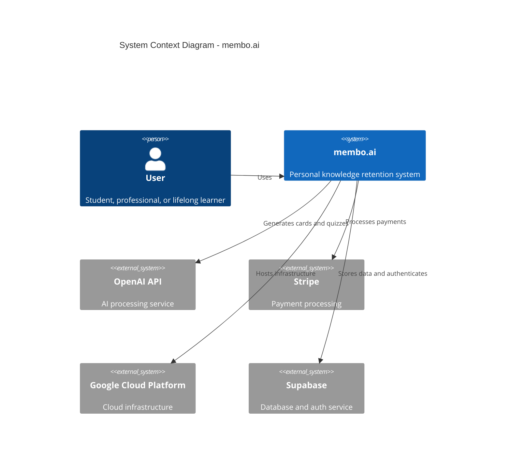

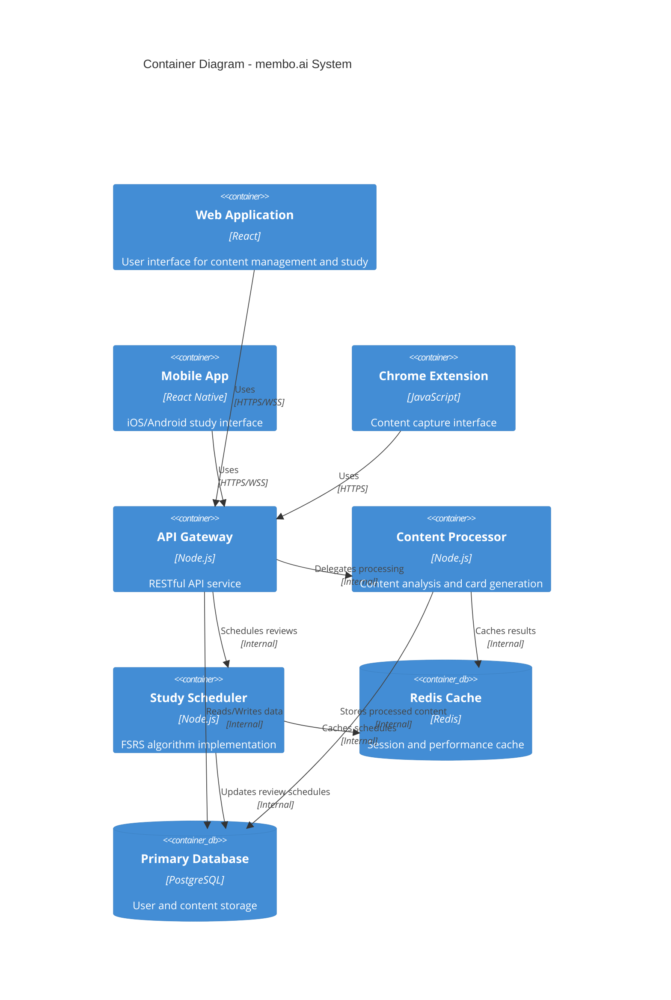

## 2.2 Component Details

### Frontend Components

| Component | Technology | Purpose | Scaling Strategy |
| --- | --- | --- | --- |
| Web Application | React + TailwindCSS | Primary user interface | Horizontal scaling with CDN |
| Mobile App | React Native | Mobile study interface | Native performance optimizations |
| Chrome Extension | JavaScript | Content capture | Browser-based caching |

### Backend Services

| Service | Technology | Responsibility | Scaling Approach |
| --- | --- | --- | --- |
| API Gateway | Node.js/Express | Request routing and authentication | Kubernetes horizontal pods |
| Content Processor | Node.js | Content analysis and card generation | Queue-based worker scaling |
| Study Scheduler | Node.js | FSRS implementation | Event-driven processing |

### Data Storage

| Store Type | Technology | Purpose | Scaling Strategy |
| --- | --- | --- | --- |
| Primary Database | Supabase PostgreSQL | Persistent data storage | Read replicas + sharding |
| Cache Layer | Redis | Performance optimization | Cluster mode + eviction |
| File Storage | GCP Cloud Storage | Media and document storage | CDN distribution |

## 2.3 Technical Decisions

### Architecture Style

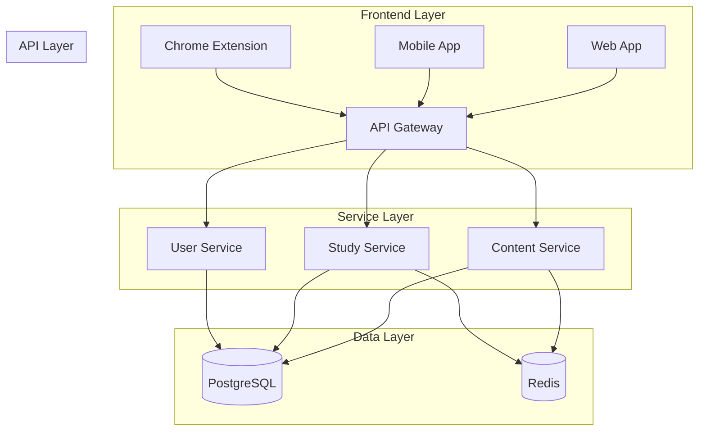

### Communication Patterns

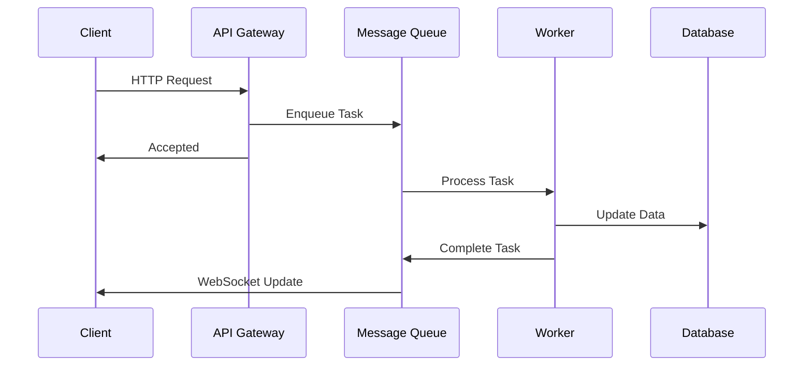

## 2.4 Cross-Cutting Concerns

### Monitoring and Security Architecture

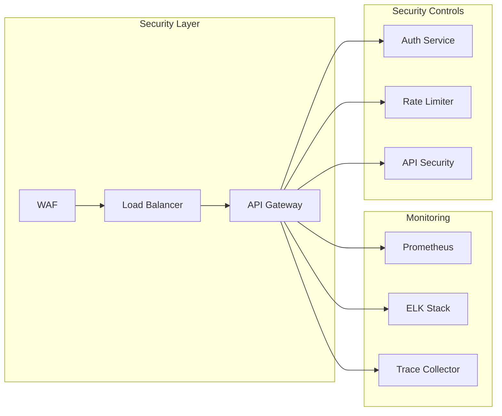

### Error Handling and Recovery

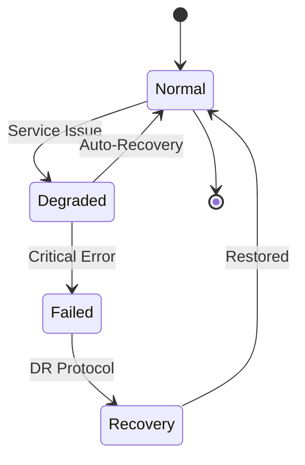

## 2.5 Deployment Architecture

```mermaid
C4Deployment
    title Deployment Diagram - membo.ai Infrastructure

    Deployment_Node(cdn, "Content Delivery Network", "CloudFlare"){
        Container(static, "Static Assets", "Web/Mobile Content")
    }
    
    Deployment_Node(gcp, "Google Cloud Platform", "Production"){
        Deployment_Node(k8s, "Kubernetes Cluster"){
            Container(api, "API Services", "Node.js Containers")
            Container(workers, "Worker Pods", "Processing Units")
        }
        
        Deployment_Node(db, "Database Cluster"){
            ContainerDb(primary, "Primary DB", "PostgreSQL")
            ContainerDb(replica, "Read Replica", "PostgreSQL")
        }
        
        Deployment_Node(cache, "Cache Cluster"){
            Container(redis, "Redis Cache", "Redis")
        }
    }
    
    Rel(cdn, k8s, "Routes requests", "HTTPS")
    Rel(k8s, db, "Persists data", "Internal")
    Rel(k8s, cache, "Caches data", "Internal")
```

# 3. SYSTEM COMPONENTS ARCHITECTURE

## 3.1 USER INTERFACE DESIGN

### Design System Specifications

| Component | Specification | Implementation |
| --- | --- | --- |
| Typography | - Primary: Inter<br>- Secondary: SF Pro<br>- Code: JetBrains Mono | TailwindCSS with custom font configuration |
| Color Palette | - Primary: #2563eb<br>- Secondary: #64748b<br>- Accent: #0ea5e9<br>- Error: #ef4444 | CSS variables with dark mode variants |
| Spacing System | 4px base unit with 4/8/12/16/24/32/48/64 scale | TailwindCSS spacing utilities |
| Breakpoints | - Mobile: 320px<br>- Tablet: 768px<br>- Desktop: 1024px<br>- Wide: 1280px | Responsive container classes |
| Components | shadcn/ui component library with custom theming | React components with Radix primitives |

### Interface Layout Structure

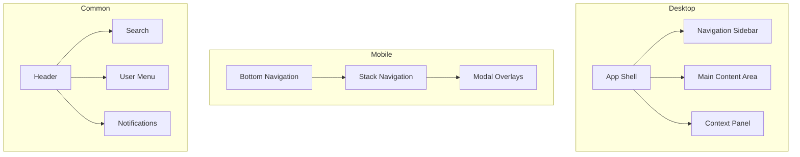

### Critical User Flows

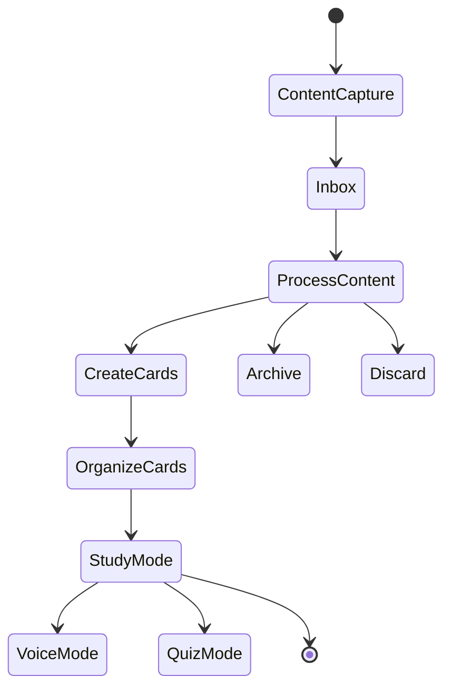

## 3.2 DATABASE DESIGN

### Schema Design

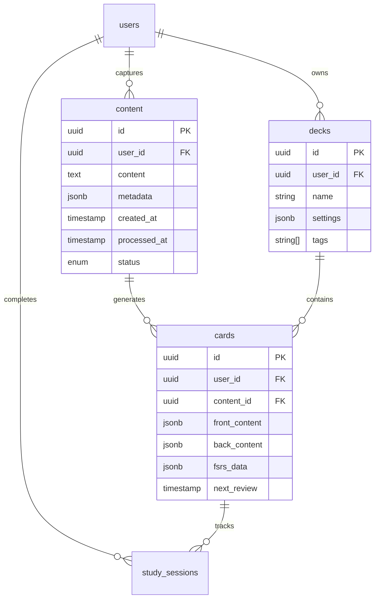

### Data Management Strategy

| Aspect | Implementation | Details |
| --- | --- | --- |
| Partitioning | Time-based partitioning for study_sessions | Monthly partitions with 12-month retention |
| Indexing | - B-tree indexes for PKs/FKs<br>- GiST indexes for text search<br>- Partial indexes for active content | Automated index maintenance schedule |
| Caching | - Redis for session data<br>- Materialized views for analytics<br>- Application-level caching | 15-minute cache invalidation cycle |
| Backup | - Continuous WAL archiving<br>- Daily full backups<br>- Point-in-time recovery | 30-day retention window |

## 3.3 API DESIGN

### API Architecture

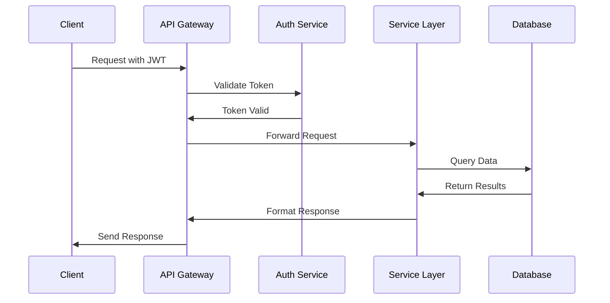

### Endpoint Specifications

| Category | Endpoint | Method | Auth | Rate Limit |
| --- | --- | --- | --- | --- |
| Content | /api/v1/content | POST, GET | Required | 100/min |
| Cards | /api/v1/cards | POST, GET, PATCH | Required | 200/min |
| Study | /api/v1/study/sessions | POST, GET | Required | 300/min |
| AI | /api/v1/ai/generate | POST | Required | Tier-based |
| Voice | /api/v1/voice/process | POST | Required | Tier-based |

### Integration Patterns

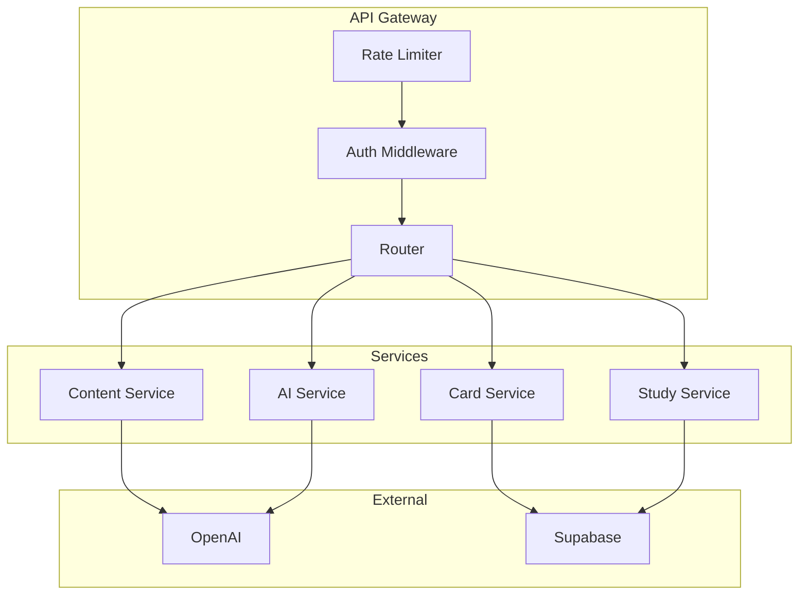

### Security Controls

| Control | Implementation | Purpose |
| --- | --- | --- |
| Authentication | JWT with refresh tokens | Identity verification |
| Authorization | RBAC with custom claims | Access control |
| Rate Limiting | Token bucket algorithm | Resource protection |
| Input Validation | JSON Schema validation | Data integrity |
| Error Handling | RFC 7807 Problem Details | Standardized errors |
| Monitoring | OpenTelemetry integration | Observability |

# 4. TECHNOLOGY STACK

## 4.1 PROGRAMMING LANGUAGES

| Platform/Component | Language | Version | Justification |
| --- | --- | --- | --- |
| Backend Services | Node.js | 20.x LTS | - Consistent with existing codebase<br>- Strong ecosystem for API development<br>- Excellent OpenAI/Supabase SDK support |
| Web Frontend | JavaScript | ES2022 | - Specified requirement to avoid TypeScript<br>- Broad developer availability<br>- Reduced complexity in build pipeline |
| Mobile Apps | JavaScript (React Native) | ES2022 | - Code sharing with web platform<br>- Rapid cross-platform development<br>- Native performance through bridge |
| Chrome Extension | JavaScript | ES2022 | - Direct browser API compatibility<br>- Shared utilities with main application<br>- Lightweight bundle size |

## 4.2 FRAMEWORKS & LIBRARIES

### Core Frameworks

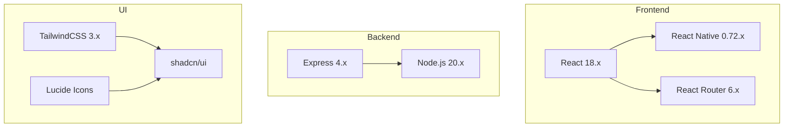

### Supporting Libraries

| Category | Library | Version | Purpose |
| --- | --- | --- | --- |
| State Management | Zustand | 4.x | - Lightweight global state<br>- Simple integration with React |
| Forms | React Hook Form | 7.x | - Performance-focused form handling<br>- Built-in validation |
| Data Fetching | TanStack Query | 4.x | - Robust data synchronization<br>- Cache management |
| Voice Processing | React Native Voice | 3.x | - Cross-platform voice recognition<br>- Native performance |
| Testing | Jest/React Testing Library | 29.x/14.x | - Component and integration testing<br>- Consistent test patterns |

## 4.3 DATABASES & STORAGE

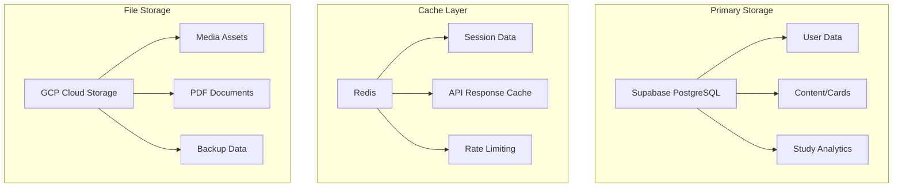

### Storage Configuration

| Storage Type | Technology | Configuration | Purpose |
| --- | --- | --- | --- |
| Primary Database | Supabase PostgreSQL | - High Availability<br>- Read Replicas<br>- Point-in-time Recovery | User data, content, analytics |
| Cache | Redis | - Cluster Mode<br>- 15-minute TTL<br>- 5GB Initial Allocation | Session management, API caching |
| Object Storage | GCP Cloud Storage | - Multi-region<br>- Standard Storage Class<br>- Lifecycle Management | Media files, documents |

## 4.4 THIRD-PARTY SERVICES

| Service Category | Provider | Purpose | Integration Method |
| --- | --- | --- | --- |
| AI Processing | OpenAI | Card generation, Quiz creation | REST API with SDK |
| Authentication | Supabase Auth | User management, OAuth | Built-in client libraries |
| Payments | Stripe | Subscription management | Official SDK + Webhooks |
| Analytics | Mixpanel | User behavior tracking | Client-side integration |
| Error Tracking | Sentry | Error monitoring, Performance | SDK integration |
| Email | SendGrid | Transactional emails | REST API |

## 4.5 DEVELOPMENT & DEPLOYMENT

### Development Pipeline

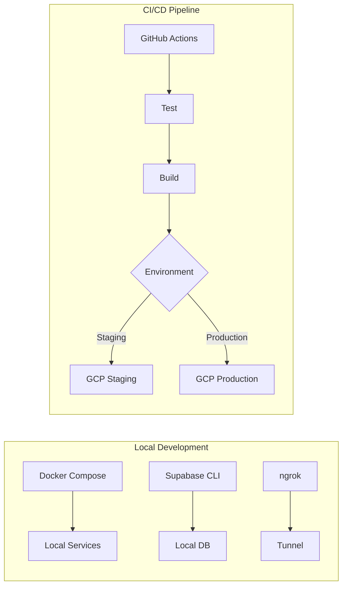

### Environment Configuration

| Environment | Infrastructure | Deployment Method | Monitoring |
| --- | --- | --- | --- |
| Development | Docker Compose | Local containers | Console logging |
| Staging | GCP Kubernetes | Automated CD | Sentry + Datadog |
| Production | GCP Kubernetes | Manual approval | Full observability |

### Build Tools

| Tool | Version | Purpose |
| --- | --- | --- |
| Vite | 4.x | Web build system |
| Metro | 0.76.x | React Native bundler |
| esbuild | 0.19.x | Extension bundling |
| Docker | 24.x | Containerization |
| GitHub Actions | N/A | CI/CD automation |

# 5. SYSTEM DESIGN

## 5.1 USER INTERFACE DESIGN

### Web Application Layout

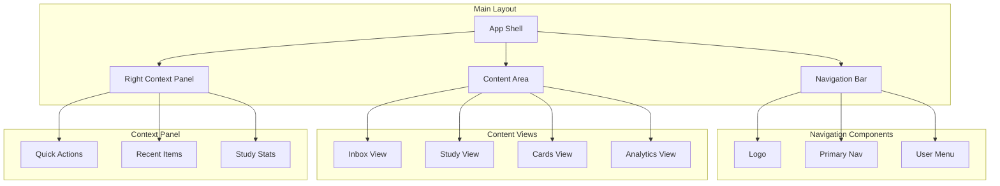

### Mobile Application Layout

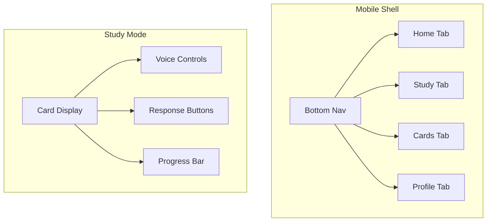

### Chrome Extension Interface

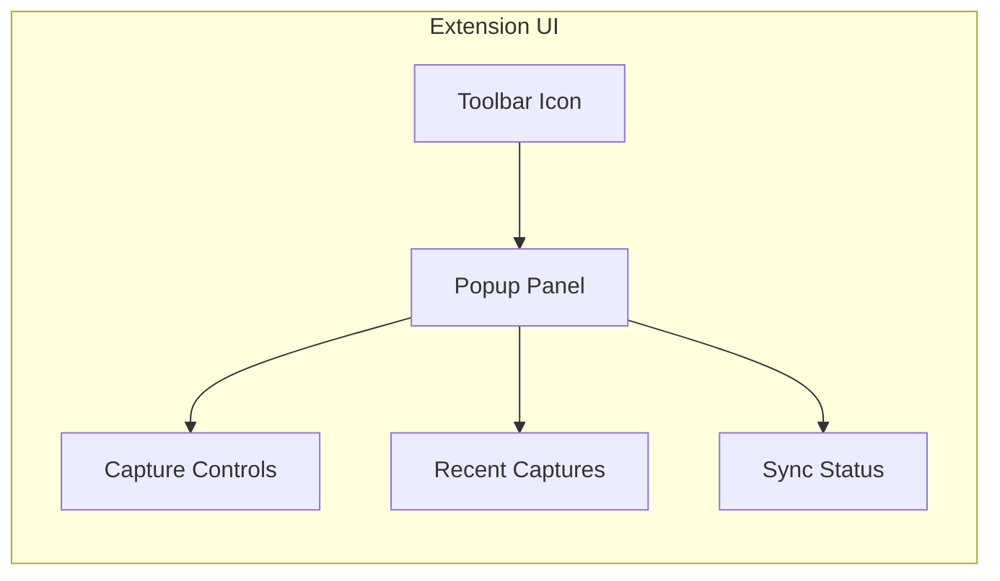

## 5.2 DATABASE DESIGN

### Core Schema

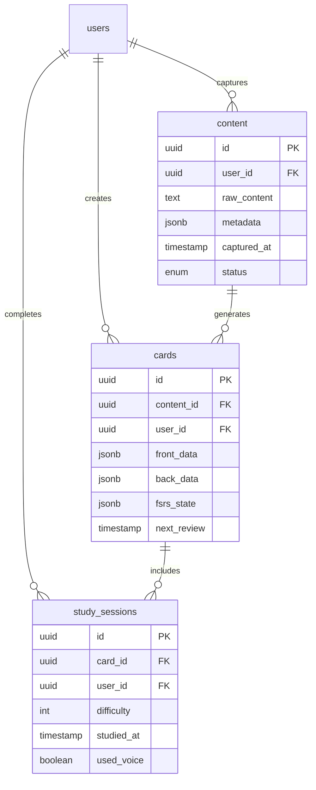

### Indexing Strategy

| Table | Index Type | Columns | Purpose |
| --- | --- | --- | --- |
| content | B-tree | (user_id, status) | Inbox queries |
| cards | B-tree | (user_id, next_review) | Study scheduling |
| cards | GiST | front_data, back_data | Full-text search |
| study_sessions | B-tree | (user_id, studied_at) | Analytics queries |

## 5.3 API DESIGN

### RESTful Endpoints

| Endpoint | Method | Purpose | Auth Required |
| --- | --- | --- | --- |
| /api/v1/content | POST | Create new content | Yes |
| /api/v1/content/process | POST | Generate cards | Yes |
| /api/v1/cards | GET | Retrieve cards | Yes |
| /api/v1/study/next | GET | Get next card | Yes |
| /api/v1/study/record | POST | Record result | Yes |

### WebSocket Events

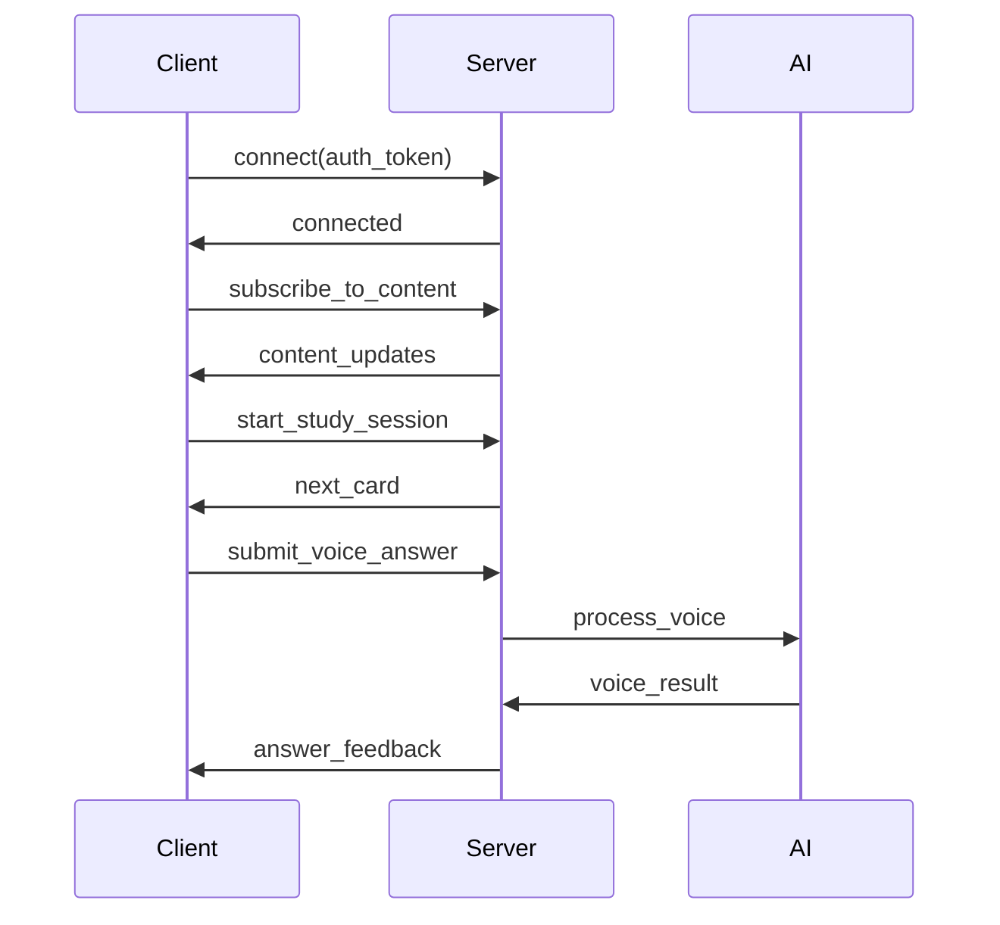

### API Response Structure

| Response Field | Type | Description |
| --- | --- | --- |
| status | string | Request status |
| data | object | Response payload |
| error | object | Error details |
| meta | object | Pagination/metadata |

### Error Handling

```mermaid
flowchart TD
    A[API Request] --> B{Validate}
    B -->|Invalid| C[400 Bad Request]
    B -->|Valid| D{Authenticate}
    D -->|Failed| E[401 Unauthorized]
    D -->|Success| F{Process}
    F -->|Error| G[500 Server Error]
    F -->|Success| H[200 OK]
```

# 6. USER INTERFACE DESIGN

## 6.1 Common Components

### Navigation Bar

```
+----------------------------------------------------------+
|  [#] membo.ai    [@]Profile  [!]Alerts  [=]Settings       |
+----------------------------------------------------------+
|                                                           |
| +----------------+ +-------------------+ +--------------+  |
| |   [i]Inbox     | |  [*]Study        | |  [+]Create   |  |
| +----------------+ +-------------------+ +--------------+  |
|                                                           |
| +----------------+ +-------------------+ +--------------+  |
| |   [#]Decks     | |  [@]Progress     | |  [?]Help     |  |
| +----------------+ +-------------------+ +--------------+  |
+----------------------------------------------------------+
```

### Content Capture Extension

```
+------------------------+
| membo.ai Capture       |
+------------------------+
| Selected Text:         |
| +--------------------+|
| |Lorem ipsum dolor...|[x]
| +--------------------+|
|                       |
| Tags:                 |
| [...................] |
|                       |
| Deck: [v]            |
| ( ) Create New Card   |
| ( ) Add to Inbox      |
|                       |
| [Save] [Cancel]       |
+------------------------+
```

## 6.2 Main Views

### Content Inbox

```
+----------------------------------------------------------+
| Inbox (12 items)                    [Search.............]  |
+----------------------------------------------------------+
| Sort by: [v]Date Captured    Filter: [v]All Types         |
|                                                           |
| +------------------------------------------------------+ |
| | [x] Web Capture - "Machine Learning Basics"           | |
| | Source: example.com/article                           | |
| | [Create Cards] [Archive] [Delete]                     | |
| +------------------------------------------------------+ |
|                                                           |
| +------------------------------------------------------+ |
| | [x] Kindle Highlight - "Design Patterns"              | |
| | Source: Chapter 3 - Factory Pattern                   | |
| | [Create Cards] [Archive] [Delete]                     | |
| +------------------------------------------------------+ |
+----------------------------------------------------------+
```

### Study Mode

```
+----------------------------------------------------------+
| Study Session - Spanish Vocabulary         [Voice Mode: ON] |
+----------------------------------------------------------+
| Progress: [=========>                ] 35%                  |
|                                                           |
| +------------------------------------------------------+ |
| |                                                      | |
| |                    Front Side                        | |
| |                    "Hello"                           | |
| |                                                      | |
| +------------------------------------------------------+ |
|                                                           |
| [Show Answer]                                             |
|                                                           |
| Confidence:                                               |
| [Again] [Hard] [Good] [Easy]                             |
|                                                           |
| Cards Remaining: 15    Time: 12:45                        |
+----------------------------------------------------------+
```

### Card Creation

```
+----------------------------------------------------------+
| Create Cards from Content                                  |
+----------------------------------------------------------+
| Source Content:                                            |
| +------------------------------------------------------+ |
| | The mitochondria is the powerhouse of the cell...    | |
| +------------------------------------------------------+ |
|                                                           |
| Generated Cards:                                          |
| +-------------------------+ +-------------------------+    |
| | Front:                  | | Back:                   |    |
| | What is the function   | | The mitochondria is     |    |
| | of mitochondria?       | | the powerhouse of       |    |
| |                        | | the cell                |    |
| +-------------------------+ +-------------------------+    |
|                                                           |
| Card Type: [v]Basic    Tags: [....................]       |
| Deck: [v]Biology                                          |
|                                                           |
| [Generate More] [Save Cards] [Cancel]                     |
+----------------------------------------------------------+
```

## 6.3 Mobile Interface

### Mobile Study View

```
+--------------------+
| < Study   [@] [=]  |
+--------------------+
|                    |
|    Front Side      |
|    "Bonjour"       |
|                    |
| [Tap to Reveal]    |
|                    |
+--------------------+
| Voice: [ON] [OFF]  |
|                    |
| [<=Swipe Options=>]|
|                    |
| [Again][Good][Easy]|
+--------------------+
```

## 6.4 UI Component Key

```
Icons:
[?] - Help/Information
[$] - Payment/Financial
[i] - Information
[+] - Add/Create New
[x] - Close/Delete
[<] [>] - Navigation
[^] - Upload
[#] - Menu/Dashboard
[@] - User/Profile
[!] - Alerts/Notifications
[=] - Settings
[*] - Favorite/Important

Input Elements:
[ ] - Checkbox
( ) - Radio Button
[Button] - Clickable Button
[...] - Text Input Field
[====] - Progress Bar
[v] - Dropdown Menu

Navigation:
+--+ - Container Border
|  | - Vertical Border
+-- - Hierarchy/Tree View
```

## 6.5 Responsive Breakpoints

```
Mobile: 320px - 767px
+------------------+
|  Single Column   |
|  Stack Layout    |
+------------------+

Tablet: 768px - 1023px
+------------------+
|  Two Column      |
|  Side Nav        |
+------------------+

Desktop: 1024px+
+-------------------------+
|  Three Column           |
|  Full Navigation        |
+-------------------------+
```

# 7. SECURITY CONSIDERATIONS

## 7.1 AUTHENTICATION AND AUTHORIZATION

### Authentication Flow

```mermaid
sequenceDiagram
    participant User
    participant Client
    participant API
    participant Supabase
    
    User->>Client: Login Request
    Client->>Supabase: Authenticate
    Supabase-->>Client: JWT Token
    Client->>API: Request + JWT
    API->>Supabase: Verify Token
    Supabase-->>API: Token Valid
    API-->>Client: Protected Resource
    
    Note over Client,API: Session expires after 30min inactivity
```

### Authorization Matrix

| Role | Content Access | Card Management | Study Features | AI Features | Admin Functions |
| --- | --- | --- | --- | --- | --- |
| Free User | Own content only | Create manual cards | Basic study mode | None | None |
| Pro User | Own content only | Create/AI generate | All study modes | Limited credits | None |
| Power User | Own + shared | Full management | All + quiz mode | Full credits | None |
| Enterprise Admin | Organization-wide | Full management | All features | Custom limits | Full access |
| System Admin | All content | Full management | All features | Unlimited | Full access |

## 7.2 DATA SECURITY

### Encryption Implementation

```mermaid
flowchart TD
    subgraph Data at Rest
    A[User Data] --> B{Encryption Layer}
    B -->|AES-256| C[Supabase Storage]
    end
    
    subgraph Data in Transit
    D[Client Request] -->|TLS 1.3| E[API Gateway]
    E -->|Internal| F[Services]
    end
    
    subgraph Sensitive Data
    G[Payment Info] -->|Stripe SDK| H[Stripe Vault]
    I[Voice Data] -->|E2E Encryption| J[Temporary Storage]
    end
```

### Data Protection Measures

| Category | Implementation | Details |
| --- | --- | --- |
| Personal Data | Field-level encryption | User PII, email addresses, preferences |
| Study Data | Row-level security | Cards, study history, performance metrics |
| Payment Data | Stripe tokenization | No direct storage of payment details |
| Voice Data | Ephemeral storage | Processed and deleted within 24 hours |
| Backups | Encrypted snapshots | Daily backups with 30-day retention |

## 7.3 SECURITY PROTOCOLS

### Access Control Implementation

```mermaid
flowchart LR
    subgraph Security Layers
    A[WAF] --> B[Rate Limiter]
    B --> C[Auth Middleware]
    C --> D[RBAC Check]
    D --> E[Resource Access]
    end
    
    subgraph Monitoring
    F[Audit Logs] --> G[Alert System]
    H[Security Scans] --> G
    I[Anomaly Detection] --> G
    end
```

### Security Measures

| Category | Control | Implementation |
| --- | --- | --- |
| API Security | Rate limiting | - 100 requests/min for free users<br>- 1000 requests/min for paid users<br>- IP-based throttling |
| Input Validation | Request sanitization | - JSON Schema validation<br>- XSS prevention<br>- SQL injection protection |
| Session Security | Token management | - JWT with 30min expiry<br>- Refresh token rotation<br>- Secure cookie handling |
| Infrastructure | Cloud security | - GCP security standards<br>- Network isolation<br>- Regular security patches |
| Monitoring | Security logging | - Audit trail for sensitive operations<br>- Real-time alert system<br>- Automated threat detection |

### Compliance Controls

| Requirement | Implementation | Monitoring |
| --- | --- | --- |
| GDPR | - Data minimization<br>- Right to be forgotten<br>- Data portability | Monthly compliance audits |
| CCPA | - Data disclosure<br>- Opt-out mechanisms<br>- Privacy notices | Quarterly assessments |
| SOC 2 | - Access controls<br>- Change management<br>- Incident response | Continuous monitoring |
| HIPAA | - PHI protection<br>- Access logging<br>- Encryption standards | Daily security checks |

# 8. INFRASTRUCTURE

## 8.1 DEPLOYMENT ENVIRONMENT

```mermaid
flowchart TD
    subgraph Production
    A[GCP Production] --> B[Primary Region]
    A --> C[Backup Region]
    end
    
    subgraph Staging
    D[GCP Staging] --> E[Single Region]
    end
    
    subgraph Development
    F[Local Docker] --> G[Development Environment]
    end
    
    B --> H[Load Balancer]
    C --> H
    H --> I[Cloud CDN]
```

| Environment | Configuration | Purpose |
| --- | --- | --- |
| Production | Multi-region GCP deployment | Live user traffic, high availability |
| Staging | Single-region GCP deployment | Pre-release testing, performance validation |
| Development | Local Docker environment | Development and testing |
| CI/CD | GitHub Actions runners | Build and test automation |

## 8.2 CLOUD SERVICES

| Service | Provider | Purpose | Configuration |
| --- | --- | --- | --- |
| Compute Engine | GCP | Application hosting | - E2 instance types<br>- Auto-scaling enabled<br>- Regional deployment |
| Cloud Storage | GCP | Static assets, backups | - Multi-region<br>- Lifecycle management<br>- CDN integration |
| Cloud SQL | GCP | Database management | - High availability<br>- Automated backups<br>- Point-in-time recovery |
| Cloud CDN | GCP | Content delivery | - Global edge network<br>- SSL/TLS termination<br>- Cache optimization |
| Cloud KMS | GCP | Key management | - Automatic rotation<br>- HSM protection<br>- Access control |

## 8.3 CONTAINERIZATION

```mermaid
graph TD
    subgraph Container Architecture
    A[Base Image] --> B[Node.js Runtime]
    B --> C[Application Layer]
    C --> D[Service Layer]
    end
    
    subgraph Container Types
    E[Web Frontend]
    F[API Services]
    G[Background Workers]
    H[Scheduled Jobs]
    end
```

| Component | Base Image | Exposed Ports | Volume Mounts |
| --- | --- | --- | --- |
| Frontend | node:20-alpine | 3000 | /app/static |
| API Server | node:20-alpine | 4000 | /app/uploads |
| Worker | node:20-alpine | N/A | /app/temp |
| Scheduler | node:20-alpine | N/A | /app/data |

## 8.4 ORCHESTRATION

```mermaid
flowchart LR
    subgraph Kubernetes Cluster
    A[Ingress Controller] --> B[Frontend Pods]
    A --> C[API Pods]
    A --> D[Worker Pods]
    
    E[ConfigMaps] --> B
    E --> C
    E --> D
    
    F[Secrets] --> B
    F --> C
    F --> D
    end
```

| Resource Type | Configuration | Scaling Policy |
| --- | --- | --- |
| Frontend Pods | - 2-10 replicas<br>- Resource limits<br>- Health checks | CPU utilization \> 70% |
| API Pods | - 3-15 replicas<br>- Resource limits<br>- Liveness probes | Request queue length |
| Worker Pods | - 2-8 replicas<br>- Resource limits<br>- Readiness probes | Job queue length |
| Storage | - Persistent volumes<br>- Storage classes<br>- Backup policies | Manual scaling |

## 8.5 CI/CD PIPELINE

```mermaid
flowchart TD
    A[Source Code] --> B{Lint & Test}
    B -->|Pass| C[Build Containers]
    B -->|Fail| D[Notify Team]
    C --> E{Deploy to Staging}
    E -->|Success| F[Run E2E Tests]
    E -->|Fail| D
    F -->|Pass| G{Manual Approval}
    F -->|Fail| D
    G -->|Approved| H[Deploy to Production]
    G -->|Rejected| D
    H --> I[Monitor Deployment]
```

| Stage | Tools | Configuration | Triggers |
| --- | --- | --- | --- |
| Code Quality | ESLint, Jest | - Standard rules<br>- Coverage thresholds<br>- Automated fixes | - Push to any branch<br>- Pull request |
| Build | Docker, GitHub Actions | - Multi-stage builds<br>- Cache optimization<br>- Version tagging | - Push to main<br>- Release tag |
| Testing | Jest, Cypress | - Unit tests<br>- Integration tests<br>- E2E tests | - Pre-deployment<br>- Scheduled |
| Deployment | Kubernetes, Helm | - Rolling updates<br>- Canary releases<br>- Rollback capability | - Manual approval<br>- Automated staging |
| Monitoring | Prometheus, Grafana | - Performance metrics<br>- Error tracking<br>- Alert rules | - Continuous<br>- Post-deployment |

# APPENDICES

## A.1 ADDITIONAL TECHNICAL INFORMATION

### Voice Processing Pipeline

```mermaid
flowchart TD
    A[Voice Input] --> B[Speech-to-Text]
    B --> C{Language Detection}
    C -->|Known Language| D[Answer Processing]
    C -->|Unknown| E[Default English]
    D --> F{Accuracy Check}
    F -->|>85%| G[Card Response]
    F -->|<85%| H[Request Repeat]
    G --> I[FSRS Update]
```

### Content Processing Queue Management

| Priority Level | Content Type | Processing Time SLA | Retry Strategy |
| --- | --- | --- | --- |
| P0 | Voice Input | \< 2s | 3x immediate retry |
| P1 | Web Capture | \< 5s | Exponential backoff |
| P2 | PDF Content | \< 10s | 3x with 1min delay |
| P3 | Kindle Import | \< 30s | 2x with 5min delay |
| P4 | Batch Processing | \< 5min | Manual retry |

## A.2 GLOSSARY

| Term | Definition |
| --- | --- |
| Card Generation Pipeline | The automated process of converting captured content into effective flashcards using AI |
| Capture-First Approach | Methodology prioritizing quick content capture before processing, similar to GTD principles |
| Cloze Deletion | A flashcard format where key terms are removed from text for learning purposes |
| Content Inbox | Central repository for newly captured information awaiting processing |
| FSRS Algorithm | Free Spaced Repetition Scheduler - Advanced algorithm for optimizing review intervals |
| Knowledge Graph | Internal representation of relationships between learned concepts |
| Power User | Subscription tier with advanced features including quiz generation and increased AI usage |
| Reverse Trial Model | Business model offering full features initially before restricting to basic tier |
| Spaced Repetition | Learning technique using increasing intervals between reviews |
| Voice Mode | Hands-free study capability using speech recognition and synthesis |

## A.3 ACRONYMS

| Acronym | Full Form |
| --- | --- |
| AI | Artificial Intelligence |
| API | Application Programming Interface |
| CCPA | California Consumer Privacy Act |
| CDN | Content Delivery Network |
| CORS | Cross-Origin Resource Sharing |
| E2E | End-to-End |
| FSRS | Free Spaced Repetition Scheduler |
| GDPR | General Data Protection Regulation |
| GCP | Google Cloud Platform |
| GTD | Getting Things Done |
| HSM | Hardware Security Module |
| JWT | JSON Web Token |
| KMS | Key Management Service |
| LMS | Learning Management System |
| MTBF | Mean Time Between Failures |
| MTTR | Mean Time To Recovery |
| RBAC | Role-Based Access Control |
| REST | Representational State Transfer |
| SLA | Service Level Agreement |
| SPA | Single Page Application |
| SRS | Spaced Repetition System |
| SSO | Single Sign-On |
| TLS | Transport Layer Security |
| TTL | Time To Live |
| UI/UX | User Interface/User Experience |
| WAF | Web Application Firewall |
| WSS | WebSocket Secure |