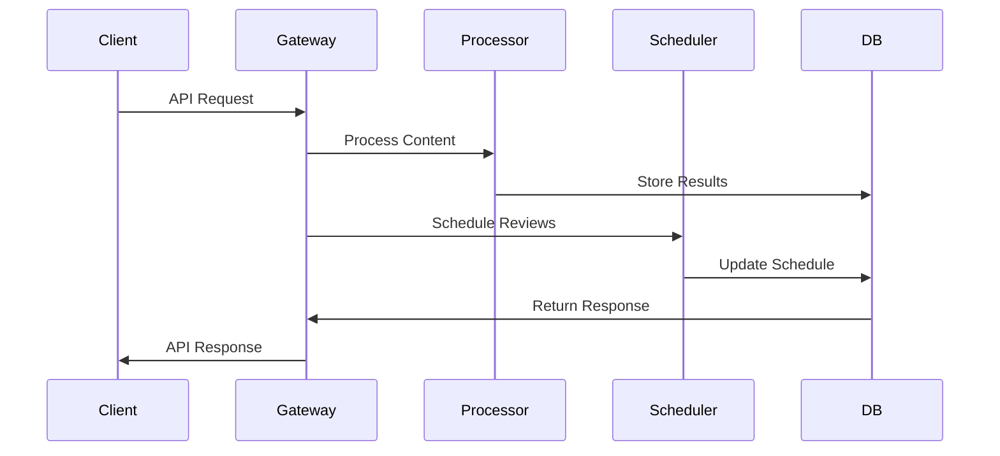
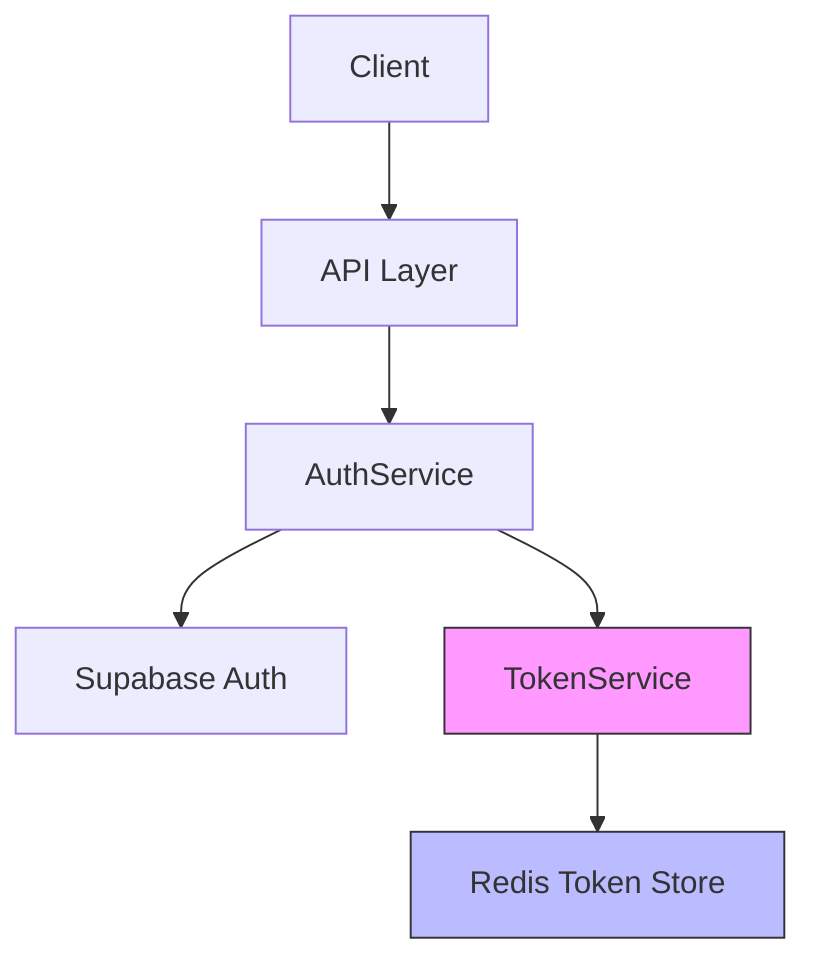

# membo.ai Backend Service

Enterprise-grade backend service for the membo.ai knowledge retention system, providing robust API endpoints, content processing, and study scheduling capabilities.

## Table of Contents
- [Prerequisites](#prerequisites)
- [Getting Started](#getting-started)
  - [Environment Setup](#environment-setup)
  - [Development](#development)
- [Architecture](#architecture)
  - [Component Overview](#component-overview)
  - [Data Flow](#data-flow)
  - [Integration Points](#integration-points)
- [Development Guide](#development-guide)
  - [Local Environment](#local-environment)
  - [Testing](#testing)
  - [Code Quality](#code-quality)
- [Deployment](#deployment)
- [Security](#security)
- [Monitoring](#monitoring)

## Prerequisites

- Node.js 20.x LTS
- Docker 24.x and Docker Compose
- PostgreSQL 15 (via Supabase)
- Redis 7
- OpenAI API access
- GCP project access
- Development SSL certificates

## Getting Started

### Environment Setup

1. Clone the repository and set up Git hooks:
```bash
git clone <repository-url>
cd src/backend
npm install
npm run prepare
```

2. Configure environment variables:
```bash
cp .env.example .env
# Edit .env with your configuration
```

3. Install dependencies:
```bash
npm install
```

4. Start development services:
```bash
docker-compose up --build
```

### Development

1. Run database migrations:
```bash
npm run migrate:dev
```

2. Seed development data:
```bash
npm run seed:dev
```

3. Start development server:
```bash
npm run dev
```

Server will be available at http://localhost:4000

## Architecture

### Component Overview

- **API Gateway** (Port 4000)
  - Request routing and authentication
  - Rate limiting and request validation
  - WebSocket connection management

- **Content Processor**
  - OpenAI integration for card generation
  - Content analysis and metadata extraction
  - Batch processing management

- **Study Scheduler**
  - FSRS algorithm implementation
  - Review scheduling optimization
  - Performance analytics

### Data Flow



### Integration Points

- **OpenAI API** (v1.0.0)
  - Card generation
  - Content analysis
  - Quiz creation

- **Supabase** (v2.39.0)
  - Data persistence
  - Authentication
  - Real-time subscriptions

- **Redis** (v7.0)
  - Session management
  - Rate limiting
  - Cache layer

## Development Guide

### Local Environment

Docker Compose services:
- API Server (4000)
- PostgreSQL (5432)
- Redis (6379)
- Mock OpenAI Server (4001)
- Mail Server (1025)

### Testing

```bash
# Unit tests
npm run test:unit

# Integration tests
npm run test:integration

# E2E tests
npm run test:e2e

# Coverage report
npm run test:coverage
```

### Code Quality

```bash
# Linting
npm run lint

# Formatting
npm run format

# Type checking
npm run validate:types

# Security audit
npm audit fix
```

## Deployment

1. Build production assets:
```bash
npm run build
```

2. Run production migrations:
```bash
npm run migrate:prod
```

3. Start production server:
```bash
npm run start:prod
```

## Security

- **Authentication**: JWT with refresh tokens
- **Authorization**: Role-based access control (RBAC)
- **Data Protection**: Field-level encryption
- **API Security**: Rate limiting, request validation
- **Compliance**: GDPR, CCPA, SOC 2

### Security Headers

```typescript
{
  "Content-Security-Policy": "default-src 'self'",
  "Strict-Transport-Security": "max-age=31536000",
  "X-Content-Type-Options": "nosniff",
  "X-Frame-Options": "DENY",
  "X-XSS-Protection": "1; mode=block"
}
```

## Monitoring

- **Metrics**: Prometheus + Grafana
- **Logging**: Winston + ELK Stack
- **Tracing**: OpenTelemetry
- **Alerts**: PagerDuty integration

### Health Checks

- `/health/live`: Liveness probe
- `/health/ready`: Readiness probe
- `/health/startup`: Startup probe

# Authentication & Session Management

## Architecture Overview

Our application implements a hybrid authentication system combining Supabase authentication with custom token management:



## Token System

### Access Token
- Short-lived JWT (30 minutes)
- Used for API request authentication
- Contains: `userId`, `email`, `role`, `jti`
- Verified on each request
- Blacklistable for immediate revocation

### Refresh Token
- Long-lived JWT (7 days)
- Stored in Redis
- Used only to obtain new access tokens
- Implements secure rotation
- One-time use (invalidated after refresh)

## Implementation Details

### Token Generation

```typescript
// Generated after successful Supabase authentication
const tokens = await tokenService.generateTokenPair(user);
// Returns: { accessToken, refreshToken }
```

### Token Verification Flow
1. Client includes access token in Authorization header
2. Middleware verifies token signature and expiration
3. Checks Redis blacklist
4. Attaches user context to request

### Token Refresh Flow
1. Client detects token expiration (5 minutes before)
2. Uses refresh token to request new token pair
3. Old refresh token is invalidated
4. New token pair is issued

### Security Features
- Token rotation on refresh
- Redis-based token blacklisting
- Rate limiting by user role
- Automatic session cleanup
- Secure token storage
- JWT payload sanitization

## Configuration

```env
JWT_SECRET=your-secret-key
JWT_REFRESH_SECRET=your-refresh-secret
TOKEN_EXPIRY=30m
REFRESH_TOKEN_EXPIRY=7d
REDIS_URL=redis://localhost:6379
```

## Rate Limiting

```typescript
const RATE_LIMITS = {
  FREE_USER: 100,
  PRO_USER: 1000,
  POWER_USER: 2000,
  ENTERPRISE_ADMIN: 5000
}
```

## Usage Examples

### Login Flow
```typescript
// 1. Authenticate with Supabase
const { data: auth } = await supabase.auth.signInWithPassword({
  email,
  password
});

// 2. Generate token pair
const tokens = await tokenService.generateTokenPair(auth.user);

// 3. Return to client
return { user: auth.user, ...tokens };
```

### Token Refresh
```typescript
// Client-side refresh before expiration
const timeUntilExpiry = sessionExpiresAt - Date.now();
if (timeUntilExpiry <= TOKEN_REFRESH_THRESHOLD) {
  const newTokens = await refreshToken();
  // Update stored tokens
}
```

### Logout
```typescript
// Invalidate both tokens
await tokenService.invalidateTokens(accessToken, refreshToken);
// Sign out from Supabase
await supabase.auth.signOut();
```

## Security Considerations

1. **Token Storage**
   - Access tokens: Never stored server-side
   - Refresh tokens: Redis with TTL
   - Client: HttpOnly cookies or secure storage

2. **Token Revocation**
   - Immediate via blacklisting
   - Automatic cleanup of expired tokens
   - Cascade invalidation on security events

3. **Session Management**
   - Automatic expiration
   - Rate limiting
   - Device tracking
   - Concurrent session control

## Testing

See `tests/integration/auth.test.ts` for comprehensive test cases covering:
- Token generation
- Token rotation
- Refresh token reuse prevention
- Session invalidation
- Rate limiting

## License

Copyright © 2024 membo.ai. All rights reserved.