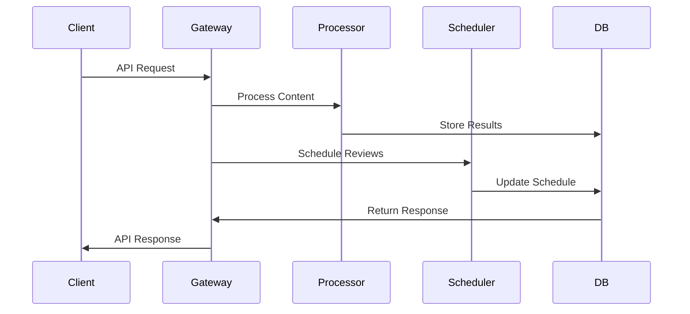

# membo.ai Backend Service

Enterprise-grade backend service for the membo.ai knowledge retention system, providing robust API endpoints, content processing, and study scheduling capabilities.

## Table of Contents
- [Prerequisites](#prerequisites)
- [Getting Started](#getting-started)
  - [Environment Setup](#environment-setup)
  - [Development](#development)
- [Architecture](#architecture)
  - [Component Overview](#component-overview)
  - [Data Flow](#data-flow)
  - [Integration Points](#integration-points)
- [Development Guide](#development-guide)
  - [Local Environment](#local-environment)
  - [Testing](#testing)
  - [Code Quality](#code-quality)
- [Deployment](#deployment)
- [Security](#security)
- [Monitoring](#monitoring)

## Prerequisites

- Node.js 20.x LTS
- Docker 24.x and Docker Compose
- PostgreSQL 15 (via Supabase)
- Redis 7
- OpenAI API access
- GCP project access
- Development SSL certificates

## Getting Started

### Environment Setup

1. Clone the repository and set up Git hooks:
```bash
git clone <repository-url>
cd src/backend
npm install
npm run prepare
```

2. Configure environment variables:
```bash
cp .env.example .env
# Edit .env with your configuration
```

3. Install dependencies:
```bash
npm install
```

4. Start development services:
```bash
docker-compose up --build
```

### Development

1. Run database migrations:
```bash
npm run migrate:dev
```

2. Seed development data:
```bash
npm run seed:dev
```

3. Start development server:
```bash
npm run dev
```

Server will be available at http://localhost:4000

## Architecture

### Component Overview

- **API Gateway** (Port 4000)
  - Request routing and authentication
  - Rate limiting and request validation
  - WebSocket connection management

- **Content Processor**
  - OpenAI integration for card generation
  - Content analysis and metadata extraction
  - Batch processing management

- **Study Scheduler**
  - FSRS algorithm implementation
  - Review scheduling optimization
  - Performance analytics

### Data Flow



### Integration Points

- **OpenAI API** (v1.0.0)
  - Card generation
  - Content analysis
  - Quiz creation

- **Supabase** (v2.39.0)
  - Data persistence
  - Authentication
  - Real-time subscriptions

- **Redis** (v7.0)
  - Session management
  - Rate limiting
  - Cache layer

## Development Guide

### Local Environment

Docker Compose services:
- API Server (4000)
- PostgreSQL (5432)
- Redis (6379)
- Mock OpenAI Server (4001)
- Mail Server (1025)

### Testing

```bash
# Unit tests
npm run test:unit

# Integration tests
npm run test:integration

# E2E tests
npm run test:e2e

# Coverage report
npm run test:coverage
```

### Code Quality

```bash
# Linting
npm run lint

# Formatting
npm run format

# Type checking
npm run validate:types

# Security audit
npm audit fix
```

## Deployment

1. Build production assets:
```bash
npm run build
```

2. Run production migrations:
```bash
npm run migrate:prod
```

3. Start production server:
```bash
npm run start:prod
```

## Security

- **Authentication**: JWT with refresh tokens
- **Authorization**: Role-based access control (RBAC)
- **Data Protection**: Field-level encryption
- **API Security**: Rate limiting, request validation
- **Compliance**: GDPR, CCPA, SOC 2

### Security Headers

```typescript
{
  "Content-Security-Policy": "default-src 'self'",
  "Strict-Transport-Security": "max-age=31536000",
  "X-Content-Type-Options": "nosniff",
  "X-Frame-Options": "DENY",
  "X-XSS-Protection": "1; mode=block"
}
```

## Monitoring

- **Metrics**: Prometheus + Grafana
- **Logging**: Winston + ELK Stack
- **Tracing**: OpenTelemetry
- **Alerts**: PagerDuty integration

### Health Checks

- `/health/live`: Liveness probe
- `/health/ready`: Readiness probe
- `/health/startup`: Startup probe

## License

Copyright © 2024 membo.ai. All rights reserved.