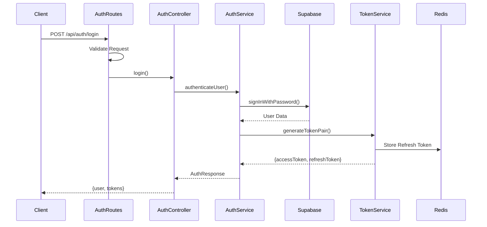

# Authentication System

## Overview

The authentication system in membo.ai implements a hybrid approach combining Supabase authentication with custom token management for enhanced security and control.

## Architecture



## Key Components

### 1. Auth Routes (`auth.routes.ts`)
- Handles `/login`, `/register`, `/refresh-token` endpoints
- Implements rate limiting and request validation
- Manages security headers and CORS
- Provides detailed error responses (RFC 7807 compliant)

### 2. Auth Controller (`AuthController.ts`)
- Orchestrates authentication flow
- Handles error cases and logging
- Manages response formatting
- Implements audit logging

### 3. Auth Service (`AuthService.ts`)
- Core authentication logic
- Integrates with Supabase
- Manages token generation and validation
- Handles user roles and permissions

### 4. Token Management
- Access Token: 30-minute JWT
- Refresh Token: 7-day token stored in Redis
- Implements token rotation and blacklisting
- Supports immediate token revocation

## Authentication Flow

1. **Login Request**
   ```typescript
   POST /api/auth/login
   {
     "email": "user@example.com",
     "password": "securepassword",
     "metadata": {
       "deviceId": "unique-device-id",
       "userAgent": "browser-info"
     }
   }
   ```

2. **Successful Response**
   ```typescript
   {
     "user": {
       "id": "user-uuid",
       "email": "user@example.com",
       "role": "FREE_USER"
     },
     "tokens": {
       "accessToken": "jwt-token",
       "refreshToken": "refresh-token",
       "expiresIn": 1800
     }
   }
   ```

## Security Features

- Rate limiting by IP and user
- Request validation and sanitization
- Secure token storage and transmission
- Audit logging of authentication events
- Device tracking and suspicious activity detection
- CORS and security headers
- Token blacklisting capability

## Error Handling

All authentication errors follow RFC 7807 Problem Details format:
```typescript
{
  "type": "https://api.membo.ai/errors/authentication",
  "title": "Authentication Failed",
  "status": 401,
  "detail": "Invalid credentials provided",
  "instance": "/api/auth/login"
}
```

## Usage Examples

### Frontend Integration
```typescript
const login = async (credentials) => {
  const response = await fetch('/api/auth/login', {
    method: 'POST',
    headers: { 'Content-Type': 'application/json' },
    credentials: 'include',
    body: JSON.stringify(credentials)
  });
  
  if (!response.ok) {
    throw new Error('Authentication failed');
  }
  
  return response.json();
};
```

### Protected Route Example
```typescript
router.get('/protected',
  authenticate,
  authorize([UserRole.PRO_USER]),
  protectedController
);
```

## Configuration

Key environment variables:
```env
JWT_SECRET=your-secret-key
JWT_REFRESH_SECRET=your-refresh-secret
TOKEN_EXPIRY=1800
REFRESH_TOKEN_EXPIRY=604800
RATE_LIMIT_LOGIN=100
RATE_LIMIT_WINDOW=900000
```
